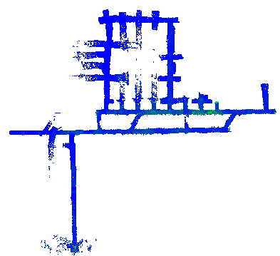

<p align="center">

</p>

# Datasets

Here, you can download the datasets. Each dataset consists of three folders:
- ```rosbag``` - the bags consisting of the unprocessed ROS messages sent from the robots to the base-station.
  - Each `${robot_name}*.bag` Consist of two topics:
    - `/husky1/lamp/keyed_scans` of type `pose_graph_msgs/KeyedScan` which are the processed point clouds attached to each node of the pose-graph.
    - `/husky1/lamp/pose_graph_incremental` of type `pose_graph_msgs/PoseGraph` which are the incremental segments of the pose-graph.
- ```g2o_pcd``` - the above ROS messages converted to g2o and pcd files.
- ```ground_truth``` - the ground-truth artifacts which consist of:
  - `${robot_name}*_odom.bag`: the ground truth odometry
  - `result.g2o`: the ground truth in g2o format.
  - `*.pcd`: the ground truth point cloud of the environment.

# LiDARs dataset
| Name | Robots | Distance (m) | Link | Map | 
|:-:|:-:|:-:|:-:|:-:|
| Tunnel               | Husky3 Husky4                    | 2556 | [link](https://drive.google.com/drive/folders/1gcUEDBp_aeGwS059xnK4Xv8qlU3JQUNE?usp=sharing) | 
| Urban                | Husky1 Husky4 Spot1              | 1530 | [link](https://drive.google.com/drive/folders/1d0QnBdwxFkcBm5z9LN0B02Xo2rUpfA0C?usp=sharing) | 
| Finals Prelim2       | Husky3 Spot1 Spot3 Spot4         | 1224 | [link](https://drive.google.com/drive/folders/1lQFQga_027wP-gj3h8OXbzBKNbi2r9o4?usp=sharing) | 
| Kentucky Underground | Husky1 Husky2 Husky3 Husky4      | 6304 | [link](https://drive.google.com/drive/folders/1myQk7hkYyCJbpGMiUfJh2SmJUkqY4kNy?usp=sharing) | 
